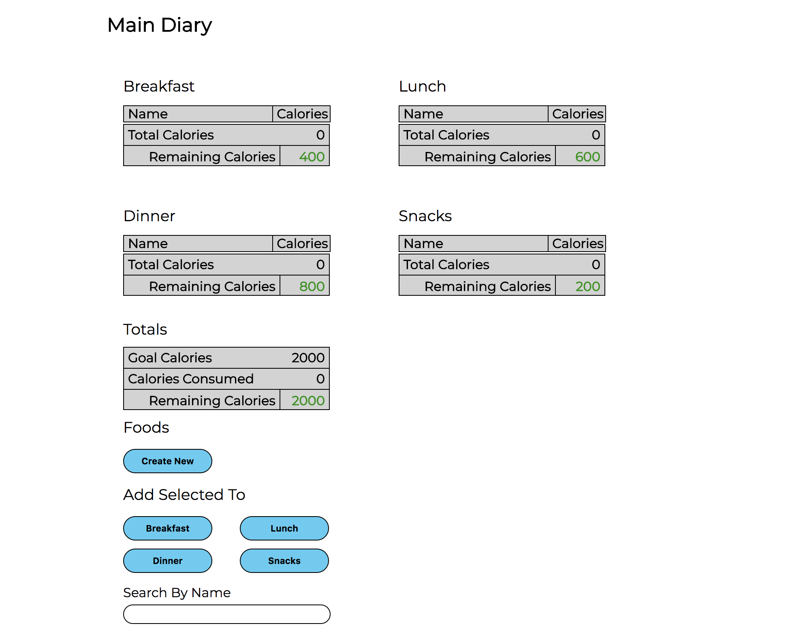
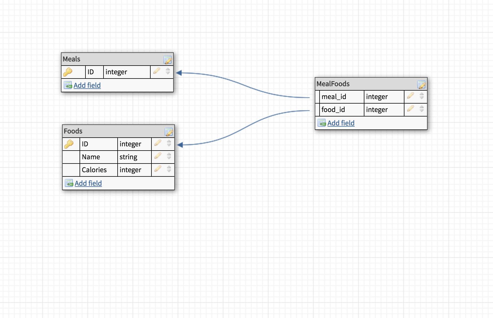

### README

# Fiver

### See The Active Site:
Front End Production Site:
[Quantified Self]([Quantified Self](http://quantified-self-fe.surge.sh/) <br>

API Base URL:
[Quantified Self Rails API](http://rails-quantified-self-dev.us-west-2.elasticbeanstalk.com)<br>

Pitch:
This app is a basic food/meal/calorie tracking application.

Tech Pitch:
This project is an introduction to true Gateway API Architecture. I am utilizing a front-end built in JavaScript which makes fetch calls to the Rails API endpoints.



### Table Of Contents
- [Database and Schema](#database-and-schema)
- [API End Points](#api-end-points)
- [Versions/Prerequisites](#versions-prerequisites)
- [Setup](#setup)
- [The Test Suite](#the-test-suite)
- [Spinning Up A Server](#spinning-up-a-server)
- [Authors](#authors)

### Database and Schema

The database is a PostgreSQL database, made up of three tables.
<br>

The first is meals, which is seeded with:
- Breakfast
- Lunch
- Dinner
- Snack
<br>

The second is foods, which each contain a name and amount of calories.
<br>

And the third is MealFoods which is a joins table between meals and foods allowing a food to be a part of many meals and also allowing a meal to have many different foods.


### API End Points
This is a restful API.

#### Foods
The food database includes full CRUD functionality at each of it's endpoints.

##### GET REQUESTS
<br>
To get the foods index:
```
GET /api/v1/foods
```
The foods will be returned in as JSON to look like:
```
[
  {
      "id": 1,
      "name": "Apple",
      "calories": 150
  },
  {
      "id": 2,
      "name": "Banana",
      "calories": 75
  },
...
]
```
<br>
To get a single food:
```
GET /api/v1/foods/{food_id}
```
Example:
```
GET /api/v1/foods/1
```
will return a response body of:
```
{
    "id": 1,
    "name": "Apple",
    "calories": 150
}
```
<br>


##### POST REQUESTS
<br>
To create a food item send:
```
POST /api/v1/foods, params: { "food": { "name": "jerky", "calories": "250"} }
```
This will return the food item as JSON
<br>


##### PATCH REQUESTS
<br>
NOTE: To update a food, you MUST pass both the name and calorie amount as parameters.

To update a food:
```
PATCH /api/foods/{food_id}, params: { "food": { "name": "jerky", "calories": "200"} }
```
<br>
##### DELETE REQUESTS
<br>
To delete a food item:
```
DELETE /api/foods/{food_id}
```
It will return a message as JSON about the success of the deletion.


#### Meals
Meals has traditional RESTFUL routes for it's index and single meal.

##### GET REQUESTS
<br>
To get the foods index:
```
GET /api/v1/meals
```
The meals will be returned in as JSON to look like:
```
[
  {
      "id": 1,
      "name": "Breakfast",
      "foods": [
          {
              "id": 1,
              "name": "Banana",
              "calories": 150
          },
          {
              "id": 6,
              "name": "Yogurt",
              "calories": 550
          },
          {
              "id": 12,
              "name": "Apple",
              "calories": 220
          }
      ]
  },
  {
      "id": 2,
      "name": "Snack",
      "foods": [
          {
              "id": 1,
              "name": "Banana",
              "calories": 150
          },
          {
              "id": 9,
              "name": "Gum",
              "calories": 50
          },
          {
              "id": 10,
              "name": "Cheese",
              "calories": 400
          }
      ]
  }
]
```

<br>
For the single meal endpoint, per the spec, I wanted to be clear that the foods were the main focus of the meal. So the path emphasizes the forcus on foods.
```
GET /api/v1/meals/{meal_id}/foods
```

#### MealFoods
The rest of the API's endpoints are to facilitate associating a food with a meal.

##### POST Requests
```
POST /api/v1/meals/{meal_id}/foods/{food_id}
```
This endpoint will route to the associated action (create) in the MealFoods controller and will create a database row associating the food to the meal. If successful it will return the following message:
```
{
    "message": "Successfully added FOODNAME to MEALNAME"
}
```

##### DELETE Requests
To remove the association between a food and a meal make a delete request:
```
DELETE /api/v1/meals/:meal_id/foods/:id
```
It will return a JSON response of:
```
{
    "message": "Successfully removed FOODNAME to MEALNAME"
}
```


### Versions/Prerequisites
---
##### Main:
To Install and run this application please be aware of the following versions and requirements:
- PostgreSQL 10+
- Rails 5.2.0
- Ruby 2.4.4

###### Secondary:
- ActiveRecord
- PG
- Puma

### Setup
---
- First clone down this repository and change directory into the project directory:
```
git clone https://github.com/nergdnvlt/rails_quantified_self
cd fiver
```
- Then in your command line run bundle to install the gem dependencies:
```
bundle
```
- Now setup your database and run the migrations to properly set up your database tables:
```
rake db:create
rake db:migrate
```
- It's now time to seed the database with the required data:
```
rake db:seed
```
- At this point the project is set up. Explore at will.

<br>

### The Test Suite
---

#### Test Information

##### Test Suite Components:
- DatabaseCleaner
- FactoryBot
- Rspec
- ShouldaMatchers

#### Test Documentation and Tweaks

- For additional documentation and the individual tests as the suite runs:
```
--format=documentation
```

##### About The Tests:
 The test suite includes test for the following:
- Model Level Testing
- API Request Testing<br>
These tests can be found in the following folder:
```
spec/models/
spec/requests/api/v1/foods
spec/requests/api/v1/meals
```

##### Running The Suite:
- In order to run the test suite, from the root project folder simply run:
```
rspec
```

<br>

### Spinning Up a Server
___

- Next spin up your server:
```
rails s
```
<br>


### Authors
- [Tyler Lundgren](https://github.com/nergdnvlt)
